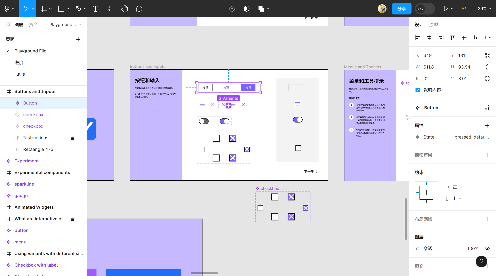
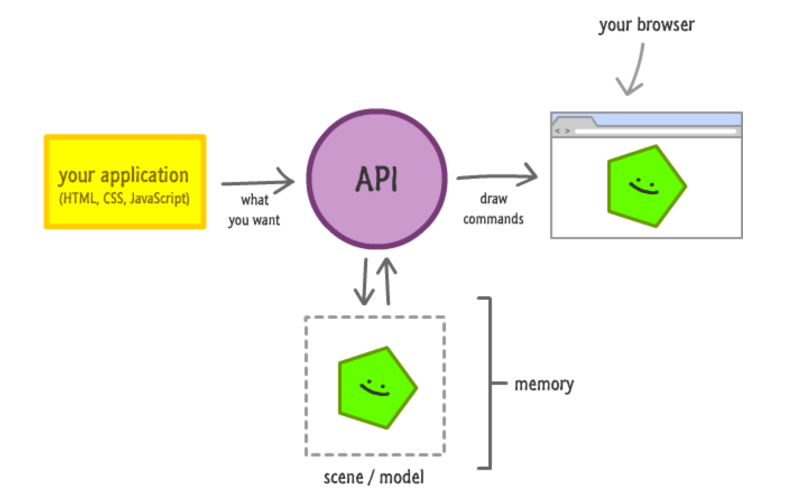
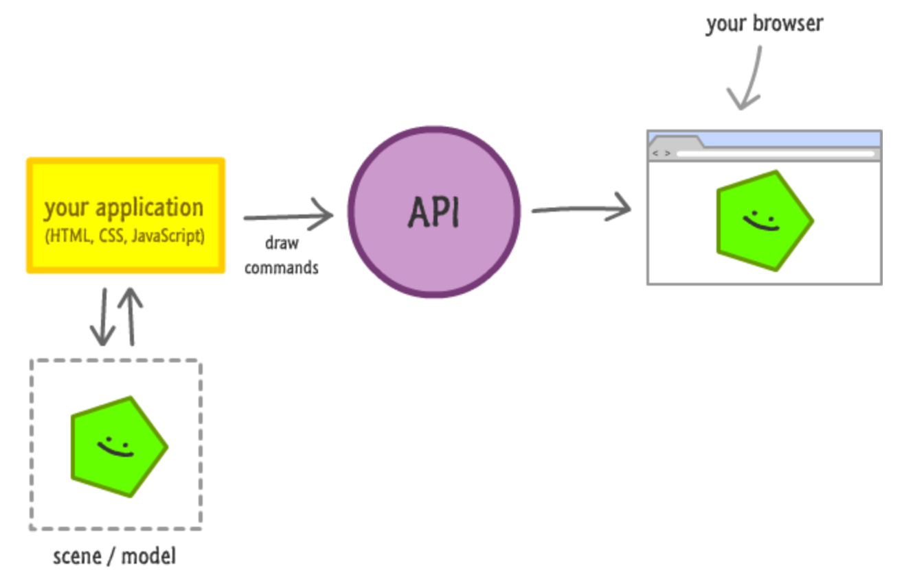

 
风起

2023-08-04

# Figma引发的思考

### Figma是什么

Figma是一个基于 **浏览器** 的协作式 UI 设计工具，从推出至今越来越受到 UI 设计师的青睐。

下面是Figma的界面：

从技术角度去看，首先会问：性能怎么样？浏览器能搞得定吗？

### 设计思路

如果自己要实现一个渲染引擎，如何设计？

浏览器器提供的几个渲染机制：基于dom节点的渲染、canvas渲染、webgl渲染、webgpu渲染；

大致分为两大类，一类是驻留模式（dom渲染），另一类是立即模式（canvas/webgl/webgpu）。

##### 驻留模式

使用简单，但无法控制一些渲染细节，不好做针对性的优化，类似工厂流水线生产，抽象层级多，统一模式绘制。

##### 立即模式

使用相对复杂，但减少了抽象层级，可以控制渲染细节，做针对性优化。

##### 如何设计

选用哪种模式，如果追求性能，那就选立即模式。

那么在动手做的过程中你会遇到一个拦路虎，JS 的性能瓶颈，因为一个渲染引擎不光是绘制，还有对抽象出的图形节点的维护。

我们一般将画布抽象成一棵节点树，画布上元素越多，这棵树越大，维护成本越高。

这里看到过一个不好的例子，AntV-G为了兼容市面上基于dom节点封装的一些库，自己根据dom标准维护了一棵dom树，当把数据和方法混在一起时，想用多线程也很难，以 JS 的执行速度，当遇到大量节点操作时就是噩梦，兼容是兼容了，但失去了性能优势。

借鉴Figma将整个逻辑放在了wasm里处理，参考[《**wasm VS js，谁快？**》](../rww/wasm-vs-js.md)，所以可以选择 “rust+wasm+wgpu” 去做渲染引擎。

### 思考

Figma里实现了文字排版、图片音视频、组件、AutoLayout、变量、生成代码等等开发熟悉的概念，尝试建立设计和开发的桥梁，已经类似一个小型浏览器了。

进一步想想，如果Figma开发模式很完备，具备了前端开发想要的一切，设计已经画好了页面，做好了交互，开发不需要画静态页面，直接在这上面绑变量写业务逻辑，一切ok了，开发还有什么理由以现有的前端框架手动再实现一遍呢，难道只是为了将渲染模式从canvas上转到dom上吗，应该不会了。

**未来的web发展，canvas可以取代dom吗，在浏览器沙箱环境下，利用wasm+webgpu可以做到接近原生的性能体验，并且不需要安装任何东西，谁还在乎语义不语义、黑不黑盒。**

回头来看flash、xhtml、html5，就能看到安全、功能、便捷、性能永远是王道。

### 参考

[《Config 2023: Reimagining where teams design and build together》](https://www.figma.com/blog/config-2023-recap/)

[《DOM与Canvas》](https://www.kirupa.com/html5/dom_vs_canvas.htm)

[《The Future Web: Will Canvas Rendering Replace the DOM?》](https://medium.com/young-coder/the-future-web-will-canvas-rendering-replace-the-dom-847be872884c)

[《详解canvas优越性能和实际应用》](https://segmentfault.com/a/1190000040564730)

