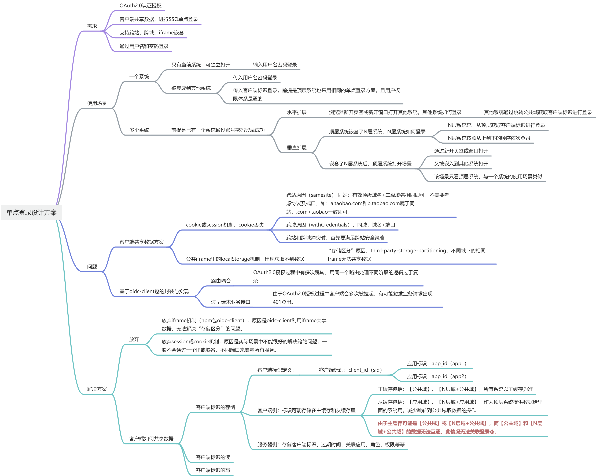
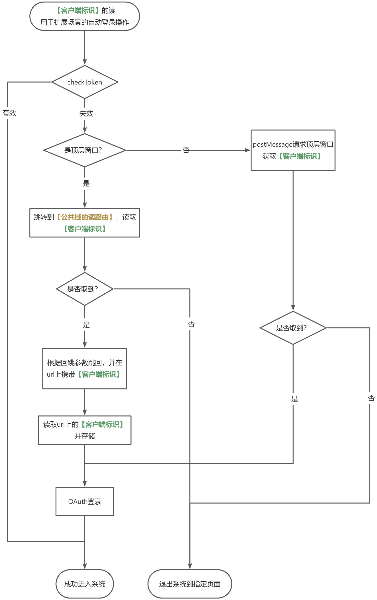
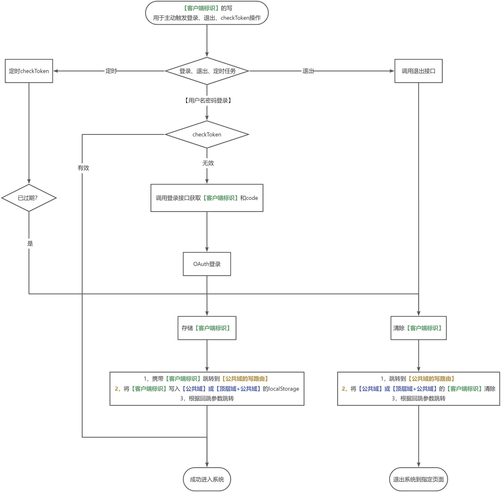

<div style="overflow:hidden;"> <div style="float:left;margin-top: 2px;margin-left: 3px;font-size: 12px;">风起</div></div>
<div style="clear:both;font-size: 12px;height:50px;line-height: 34px;">2023-12-15</div>

# 单点登录设计方案

### 需求

公司业务上需要满足以下功能：

- 需要用OAuth2.0认证授权
- 客户端共享数据，进行SSO单点登录
- 支持跨站、跨域、iframe嵌套
- 通过用户名和密码登录

### 使用场景

#### 一个系统

- 只有当前系统，可独立打开
  - 输入用户名密码登录
- 被集成到其他系统
  - 传入用户名密码登录
  - 传入客户端标识登录，前提是顶层系统也采用相同的单点登录方案，且用户权限体系是通的

#### 多个系统

前提是已有一个系统通过账号密码登录成功

- 水平扩展
  - 浏览器新开页签或新开窗口打开其他系统，其他系统如何登录
    - 其他系统通过跳转公共域获取客户端标识进行登录

- 垂直扩展
  - 顶层系统嵌套了N层系统，N层系统如何登录
    - N层系统统一从顶层获取客户端标识进行登录
    - N层系统按照从上到下的顺序依次登录
  - 嵌套了N层系统后，顶层系统打开场景
    - 通过新开页签或窗口打开
    - 又被嵌入到其他系统打开
    - 该场景只看顶层系统，与一个系统的使用场景类似

### 问题

#### 客户端共享数据方案缺陷

- cookie或session机制，cookie丢失
  - 跨站原因（samesite）,同站：有效顶级域名+二级域名相同即可，不需要考虑协议及端口，如：a.taobao.com和b.taobao.com属于同站，.com+taobao一致即可。
  - 跨域原因（withCredentials），同域：域名+端口
  - 跨站和跨域冲突时，首先要满足跨站安全策略
- 公共iframe里的localStorage机制，出现获取不到数据
  - “存储区分”原因，third-party-storage-partitioning，不同域下的相同iframe无法共享数据

#### 基于oidc-client包的实现缺陷

- 路由耦合
  - OAuth2.0授权过程中有多次跳转，用同一个路由处理不同阶段的逻辑过于复杂
- 过早请求业务接口
  - 由于OAuth2.0授权过程中客户端会多次被拉起，有可能触发业务请求出现401登出

### 解决方案

OAuth2.0这里没问题，关键是要想好客户端如何共享数据。

#### 放弃

- 放弃iframe机制（npm包oidc-client），原因是oidc-client利用iframe共享数据，无法解决“存储区分”的问题。
- 放弃session或cookie机制，原因是实际场景中不能很好的解决跨站问题，一般不会通过一个IP或域名，不同端口来暴露所有服务。

#### 客户端如何共享数据

- 客户端标识的存储

  - 客户端标识定义，客户端标识：client_id（sid），应用标识：app_id（app1）

    ```
    clientid(sid): [app_id(app1), app_id(app2), ......]
    ```

  - 客户端侧：标识可能存储在主缓存和从缓存里

    - 主缓存包括：【公共域】、【N层域+公共域】，所有系统以主缓存为准
    - 从缓存包括：【应用域】、【N层域+应用域】，作为顶层系统提供数据给里面的系统用，减少跳转到公共域取数据的操作
    - **由于主缓存可能是【公共域】或【N层域+公共域】，而【公共域】和【N层域+公共域】的数据无法互通，此情况无法关联登录态。**

  - 服务器侧：存储客户端标识、过期时间、关联应用、角色、权限等等

- 客户端标识的读

- 客户端标识的写


### 思维导图





### 客户端标识的读





### 客户端标识的写


### 
