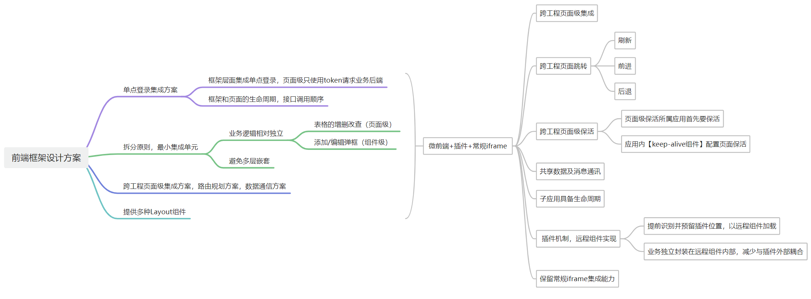
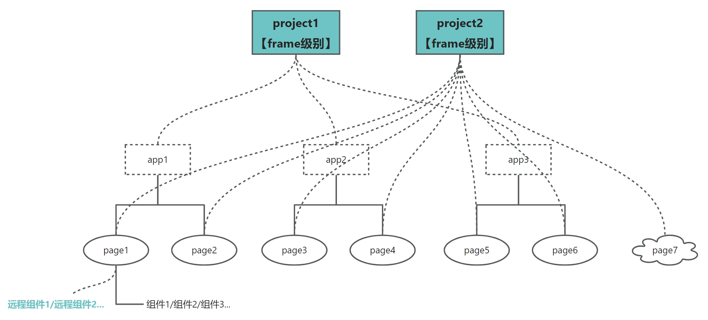

 
风起

2023-08-03

# 前端框架搭建-微前端

### 需求

公司业务上需要一个前端框架，主要满足以下功能：

- 方便的集成各个应用服务下的页面
- 不管是应用内部跳转还是跨应用的跳转，页面都能够保活，且可以自由控制删除保活的实例
- 可动态配置菜单
- 支持多种布局，有的页面需要左侧菜单和顶部导航，有的页面不需要这些
- 提供一种登录鉴权机制
- 能够做到基座应用和子应用的前端框架无关
- 能够动态替换掉页面上的某个组件
- 弹框、浏览器刷新、前进后退，交互体验像是一个应用

### 设计

鉴于以上需求，最好的解决方案是微前端，微前端做应用级或页面级的集成，组件级的用插件机制（远程组件）来集成。

微前端集成后的结构如下图：

- 每个应用是一个服务，应用底下都有各自的页面及路由
- 框架层可以集成应用级别，用应用自己的菜单
- 框架层也可以直接跨应用集成到页面级别，动态配置自己的菜单
- 远程组件以插件的机制挂到页面上，前提是提前预留位置及接口

### 扩展

确实有这样的需求存在所以才出现微前端，感觉前端总是在做兼容，浏览器的兼容，框架的兼容，修修补补，当然兼容性也是微前端需要考虑的一个重要因素。如果不考虑兼容，那可玩的方案也很多。

### 吐槽

- 三年前做集成方案汇报时我提到微前端，当时领导第一次听一笑而过并坚持用iframe，三年后我做的技术选型依然是微前端，这次开始着手做了。
- 这次提到远程组件和插件机制时，同事们好像没听懂，那就这样吧，等看到实际使用就明白了。
- 能够提供保活功能，但不提供删除保活缓存的接口，就是耍流氓。
