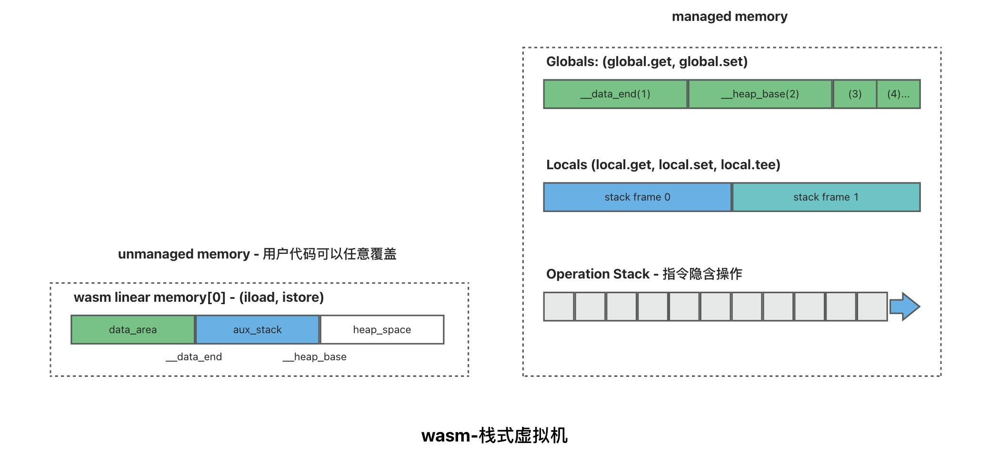

 
风起

2023-06-24

# wasm内存模型

## wasm内存模型：

wasm是一种栈式虚拟机，没有寄存器的概念，所有操作数都放在运行时的栈上。内存分为托管堆栈和非托管堆栈。

我们将线性内存中由编译器组织的堆栈称为“非托管堆栈(unmanaged memory)”，非托管堆栈可以暴露给外部供js读写访问。

其余的是“托管堆栈(managed memory)”，托管堆栈不受用户控制。

## js与wasm传参：

设计原则：

- 最小化复制

- 最小化序列化

在Rust侧将中大型长期存在的数据结构暴露指针给js，同时暴露出相关的操作函数，js通过调用这些函数并传入相关数据结构的指针，由函数内部执行复杂的运算，最终返回一个最小化的可复制的结果供js使用。

*参考文献：*

- *[WebAssembly 的核心语言特性与未来发展](https://www.infoq.cn/article/jds0wdtz7dsugzpc81hs)*  
- *[wasm shadow stack](https://news.ycombinator.com/item?id=24220630)*  
- *[华为 | WebAssembly 安全性调研](https://rustmagazine.github.io/rust_magazine_2021/chapter_6/webassmebly-security.html)*  
- *[【译】WebAssembly中的内存（为什么比你想象的更安全）](https://juejin.cn/post/7080152136717336590)*  
- *[浅谈WASM栈式虚拟机模型](https://excitedspider.github.io/WASM%E6%A0%88%E5%BC%8F%E8%99%9A%E6%8B%9F%E6%9C%BA%E6%A8%A1%E5%9E%8B/)*  
- *[创建并使用WebAssembly模块](https://juejin.cn/post/6983105166845149221)*  