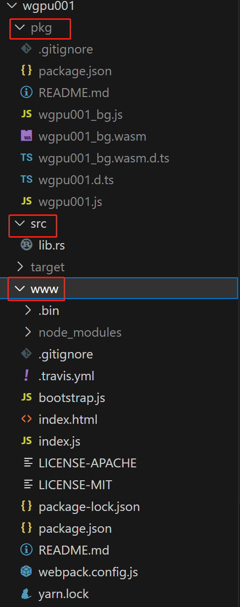

<div style="overflow:hidden;"> <div style="float:left;margin-top: 2px;margin-left: 3px;font-size: 12px;">风起</div></div>
<div style="clear:both;font-size: 12px;height:50px;line-height: 34px;">2023-09-09</div>

# wasm与wgpu（一）：窗口
## 窗口容器

绘图前首先需要一个绘图载体，这个载体就是窗口，对于web来说就是一个canvas画布。可以用第三方窗口管理库或自己手动实现。

关于窗口的示例工程见:[【wgpu001】](https://github.com/zxhsure/learn/tree/main/wgpu001)



主要的三个目录：【pkg】是rust编译后生成的wasm目录，【src】是rust目录。【www】是前端web目录，会引用到【pkg】下的文件。

## Winit

纯rust编写的跨平台的窗口管理库，对于web来说一个Winit窗口对应一个canvas元素，你可以为Winit创建一个canvas，或让Winit创建一个canvas。

## 条件编译

lib.rs

```rust
#[cfg(target_arch = "wasm32")]
{
        #[cfg(feature = "console_error_panic_hook")]
        std::panic::set_hook(Box::new(console_error_panic_hook::hook));

        console_log::init_with_level(log::Level::Warn).expect("Couldn't initialize logger");
}
```

```
// 告诉编译器下面这段代码只针对web平台编译，其他平台忽略，如果不告诉编译器会报错。
#[cfg(target_arch = "wasm32")]

// 告诉编译器检查该console_error_panic_hook功能是否在编译时设置。如果是，它将调用，如果不是就不会。
#[cfg(feature = "console_error_panic_hook")]
```

Cargo.toml

```
console_error_panic_hook = { version = "0.1.6", optional = true }

[features]
default = ["console_error_panic_hook"]
```

如果开启`optional`默认不被编译

`features`下的特性默认都是关闭的，`default`里列出默认开启的特性。

## 闭包

rust里的闭包和js里的含义一样，就是闭包可以捕获其定义时所在作用域中的变量。

先看看js里的闭包，我们可以通过`addA`函数使用变量`a`

```javascript
function closeTest() {
    const a = 1;
    const addA = (b) => (a + b);
    return addA;
}
```

再看看rust里的闭包，不过下面代码会编译报错，因为`addA`不是闭包，rust里闭包有特殊的写法。

```rust
fn closeTest() {
    let a: i32 = 1;
    fn addA(b: i32) {
        a + b
    }
}
```

顺便介绍下rust内存管理：

- rust不同于js，多了所有权的概念，通过所有权系统，让rust无需垃圾回收即可保证内存安全。
- 一些重要概念，示例代码见[《wasm VS js, 谁快?》](./wasm-vs-js.md)
  - 变量的生命周期
  - 栈，`拷贝`
  - 堆，`引用/切片（可变/不可变）`、`克隆`、`转移`、`借用（可变/不可变）`、`原始指针`
  
- rust所有权管理规则：
  - Rust 中的每一个值都有一个 所有者（owner）。
  -  值在任一时刻有且只有一个所有者。
  - 当所有者（变量）离开作用域，这个值将被丢弃。

由于普通函数无法捕获环境里的变量，所以需要闭包，rust里的闭包如下

```rust
fn closeTest() {
    let a: i32 = 1;
    let addA = |b| a + b;
}
```

这时`addA`函数不需要传参就可以直接使用变量`a`了。

闭包的特点：

- 声明时使用 `||` 替代 `()` 将输入参数括起来。
- 函数体定界符（`{}`）对于单个表达式是可选的，其他情况必须加上。
-  有能力捕获其定义所在环境的变量。
- 输入输出类型会自动推导。
- 闭包捕获变量的方式很灵活，既可以是`转移`，也可以是`引用（可变/不可变）`，如果强制使用`转移`则在 `||` 前加 `move`关键字。

## 模式与模式匹配

```rust
event_loop.run(move |event, _, control_flow| match event {
        Event::WindowEvent {
            ref event,
            window_id,
        } if window_id == window.id() => match event {
            WindowEvent::CloseRequested
            | WindowEvent::KeyboardInput {
                input:
                    KeyboardInput {
                        state: ElementState::Pressed,
                        virtual_keycode: Some(VirtualKeyCode::Escape),
                        ..
                    },
                ..
            } => *control_flow = ControlFlow::Exit,
            _ => {}
        },
        _ => {}
});
```

模式语法有好几种，这里用到了`解构并模式匹配`，和`匹配守卫（模式分支后额外加的if条件，它也被满足时才能进该分支）`。

在通过模式匹配或解构时，可通过`ref` 关键字来创建结构体或元组里字段的引用。

来看下面简单的`解构并模式匹配`示例：

```rust
fn main() {
    let p = Point { x: 0, y: 7 };

    match p {
        Point { x, y: 0 } => println!("所有在x轴上的点的x坐标: {x}"),
        Point { x: 0, y } => println!("所有在y轴上的点的y坐标: {y}"),
        Point { x, y } => {
            println!("所有不在x轴且不在y轴上的点的坐标: ({x}, {y})");
        }
    }
}
```

