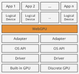

<div style="overflow:hidden;"> <div style="float:left;margin-top: 2px;margin-left: 3px;font-size: 12px;">风起</div></div>
<div style="clear:both;font-size: 12px;height:50px;line-height: 34px;">2023-09-10</div>

# wasm与wgpu（二）：展示平面
## 展示平面（Surface）

上节内容介绍了窗口，窗口作为载体在web端对应的是`canvas`。

这节内容介绍展示平面`surface`，示例工程代码见[【wgpu002】](https://github.com/zxhsure/learn/tree/main/wgpu002)


展示平面`surface`则让`canvas`作为`webgpu`的一个纹理与`webgpu`进行渲染互动，在`canvas`和`webgpu`之间扮演着沟通桥梁。

- `usage` 字段描述了 `SurfaceTexture` 如何被使用。`RENDER_ATTACHMENT` 指定将被用来渲染到屏幕的纹理。

- `format` 定义了 `SurfaceTexture` 在 GPU 内存上如何被存储。不同的显示设备偏好不同的纹理格式，我们使用`surface.get_capabilities(&adapter).formats` 来获取当前显示设备的最佳格式。

- `present_mode` 指定**展示平面（Surface）**如何与**显示设备**同步。我们选择的`PresentMode::Fifo` 指定了显示设备的刷新率做为渲染的帧速率，这本质上就是**垂直同步**（VSync），所有平台都得支持这种**呈现模式**。

```rust
let surface_caps = surface.get_capabilities(&adapter);
let config = wgpu::SurfaceConfiguration {
            usage: wgpu::TextureUsages::RENDER_ATTACHMENT,
            format: surface_caps.formats[0],
            width: size.width,
            height: size.height,
            present_mode: surface_caps.present_modes[0],
            alpha_mode: surface_caps.alpha_modes[0],
            view_formats: vec![],
        };
surface.configure(&device, &config);
```


## wgpu实例（Instance）

wgpu实例`instance`是使用wgpu库创建的第一个对象，其主要用途是创建适配器`adapter`和展示平面`surface`。

```rust
// 创建wgpu实例(instance)
let instance = wgpu::Instance::new(wgpu::InstanceDescriptor {
            backends: wgpu::Backends::all(),
            dx12_shader_compiler: Default::default(),
});

// 通过wgpu实例创建展示平面(surface)
let surface = unsafe { instance.create_surface(&window) }.unwrap();

// 通过wgpu实例创建适配器(adapter)
let adapter = instance
            .request_adapter(&wgpu::RequestAdapterOptions {
                power_preference: wgpu::PowerPreference::default(),
                compatible_surface: Some(&surface),
                force_fallback_adapter: false,
            })
            .await
            .unwrap();
```


## 适配器（Adapter）



我们接触的第一个抽象是适配器和逻辑设备。

物理GPU通过驱动将GPU的功能暴露给操作系统，操作系统通过图形API（如`Vulkan`或`Metal`）将GPU的功能暴露给上层应用。

适配器是从操作系统提供的图形API到`WebGPU`的抽象，抽象出多个逻辑设备，让每个WEB应用感觉像是拥有对GPU的唯一控制权。

## 逻辑设备（Logical Device）

逻辑设备是由适配器抽象出来的，可以通过`adapter.request_device()`向适配器请求逻辑设备`device`和命令队列`queue`。

```rust
// 通过适配器(adapter)请求逻辑设备(device)和命令队列(queue)
let (device, queue) = adapter
            .request_device(
                &wgpu::DeviceDescriptor {
                    label: None,
                    features: wgpu::Features::empty(),
                    // WebGL doesn't support all of wgpu's features, so if
                    // we're building for the web we'll have to disable some.
                    limits: if cfg!(target_arch = "wasm32") {
                        wgpu::Limits::downlevel_webgl2_defaults()
                    } else {
                        wgpu::Limits::default()
                    },
                },
                // Some(&std::path::Path::new("trace")), // Trace path
                None,
            )
            .await
            .unwrap();
```

## 命令队列（Queque）

GPU是具有自己内存的芯片，可以通过命令缓冲区或命令队列`queque`来控制它。命令队列存储着用于GPU执行的编码命令，编码高度针对GPU，由驱动程序负责。

可以通过`adapter.request_device()`向适配器请求命令队列，通过`self.queue.submit()`将渲染命令队列提交给GPU。

```rust
// 渲染队列提交给GPU
self.queue.submit(iter::once(encoder.finish()));
// 展示平面同步给显示设备
output.present();
```


## 命令编码器（CommandEncoder）

通过命令编码器可以创建渲染管道或计算管道，可对管道进行设置和编码。

```rust
// 通过逻辑设备(device)创建命令编码器
let mut encoder = self.device.create_command_encoder(&wgpu::CommandEncoderDescriptor {
    label: Some("Render Encoder"),
});
```

## 管道（Pass）

通过命令编码器来创建管道，目前，WebGPU 允许你创建两种类型的管道：渲染管道`render_pass`和计算管道`compute_pass`。

- 渲染管道，顾名思义渲染某些东西，这意味着它创建了一个 2D 图像，该图像不必在屏幕上，而可以只渲染到内存（称为帧缓冲区）。
- 计算管道更通用，因为它返回一个缓冲区，该缓冲区可以包含任何类型的数据。
- 管道由一个或多个可编程阶段组成，其中每个阶段由一个着色器和一个入口点定义。计算管道只有一个`compute`阶段，而渲染管道将有一个`vertex`和一个`fragment`阶段。

```rust
// 编码器创建渲染管道
let _render_pass = encoder.begin_render_pass(&wgpu::RenderPassDescriptor {
                label: Some("Render Pass"),
                color_attachments: &[Some(wgpu::RenderPassColorAttachment {
                    view: &view,
                    resolve_target: None,
                    ops: wgpu::Operations {
                        load: wgpu::LoadOp::Clear(wgpu::Color {
                            r: 0.1,
                            g: 0.2,
                            b: 0.3,
                            a: 1.0,
                        }),
                        store: true,
                    },
                })],
                depth_stencil_attachment: None,
            });
```

