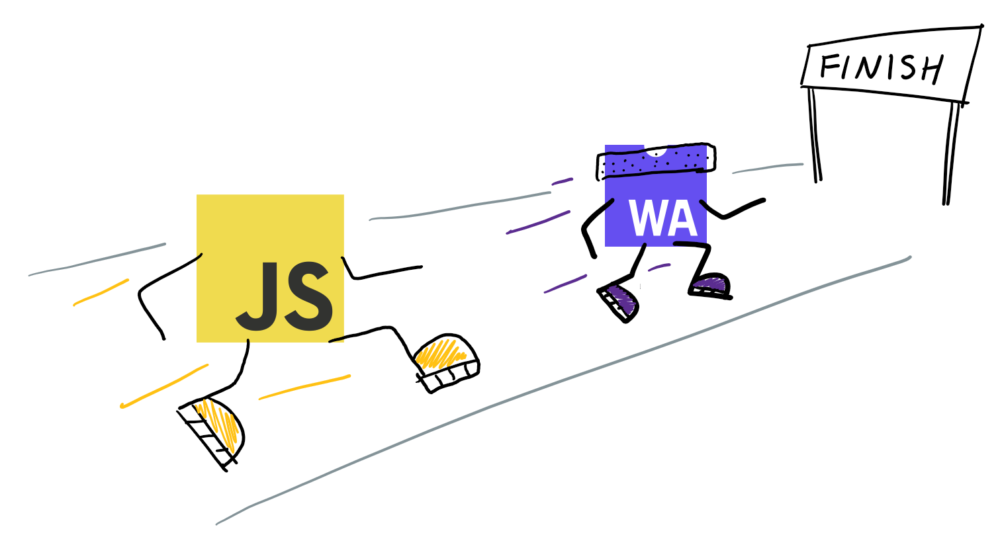

<div style="overflow:hidden;"> <div style="float:left;margin-top: 2px;margin-left: 3px;font-size: 12px;">风起</div></div>
<div style="clear:both;font-size: 12px;height:50px;line-height: 34px;">2023-06-28</div>

# wasm VS js，谁快？



我们做一个测试，分别用wasm和js构建同一棵树，实现算法也相同，来对比下谁更快，初步了解下wasm的性能，这里用rust编译wasm。

我们构造的树结构如下

```
{
	name: "node_0_0",
	children: [
		{
			name: "node_1_0",
			children: [...],
		},
		{
			name: "node_1_1",
			children: [...],
		},
		...
	],
}
```

## 第一次尝试：

rust代码

```
#[wasm_bindgen]
#[derive(Clone)]
pub struct Item {
    name: String,
    children: Vec<Item>,
}

#[wasm_bindgen]
pub fn treeFun(treeLevel: u32, nodeWidth: u32) -> Item {
    let tempNode = Item {
        name: String::from(""),
        children: vec![],
    };

    let mut root = tempNode.clone();
    root.name = String::from("node_0_0");

    if treeLevel < 2 {
        return root;
    }

    let mut nodeStack: Vec<&mut [Item]> = vec![];

    for m1 in 0..nodeWidth {
        let mut curItem = tempNode.clone();
        curItem.name = format!("node_{}_{}", 1, m1);
        root.children.push(curItem);
    }

    let mut vs: Vec<&mut [Item]> = root.children.chunks_mut(1).collect();
    for m2 in vs.iter_mut() {
        nodeStack.push(*m2);
    }

    for i in 2..treeLevel {
        let curTotal: u32 = nodeWidth.pow(i - 1);

        for j in 0..curTotal {
            let shiftItem = nodeStack.remove(0);

            for k1 in 0..nodeWidth {
                let mut curItem = tempNode.clone();
                curItem.name = format!("node_{}_{}", i, nodeWidth * j + k1);
                shiftItem[0].children.push(curItem);
            }

            let mut ss: Vec<&mut [Item]> = shiftItem[0].children.chunks_mut(1).collect();
            for _ in 0..nodeWidth {
                let curSs = ss.remove(0);
                nodeStack.push(curSs);
            }
        }
    }

    root
}
```

js代码

```
const treeFun = (treeLevel, nodeWidth) => {
	const tempNode = {
    	name: '',
    	children: [],
	};
	
    const root = JSON.parse(JSON.stringify(tempNode));
    root.name = 'node_0_0';

    if (treeLevel < 2) {
        return root;
    }

    const nodeStack = [];

    for (var m1=0; m1<nodeWidth; m1++) {
        const curItem = JSON.parse(JSON.stringify(tempNode));
        curItem.name = `node_1_${m1}`;
        root.children.push(curItem);
    }

    for (var m2=0; m2<nodeWidth; m2++) {
        nodeStack.push(root.children[m2]);
    }

    for (var i=2; i<treeLevel; i++) {
        const curTotal = Math.pow(nodeWidth, (i-1));

        for (var j=0; j<curTotal; j++) {
            const shiftItem = nodeStack.shift();

            for (var k1=0; k1<nodeWidth; k1++) {
                const curItem = JSON.parse(JSON.stringify(tempNode));
                curItem.name = `node_${i}_${nodeWidth * j + k1}`;
                shiftItem.children.push(curItem);
            }

            for (var k2=0; k2<nodeWidth; k2++) {
                nodeStack.push(shiftItem.children[k2]);
            }
        }
    }

    return root;
}
```

我们尝试构造的树有7层深度，每个节点下有8个子节点，共299593个节点，执行结果如下

```
total nodes:  299593
wasm-tree: 31134.56591796875 ms
js-tree: 7428.5888671875 ms
```

可以看到js执行速度明显快，奇怪了，与预期不符。

分析rust代码，发现这里的逻辑主要包含： 循环、对象深拷贝、向量的切片、数学函数、向量的插入和删除等几部分。

我们按照这几块分别测试，看看到底哪里慢了。

## 第二次尝试：循环性能对比

我们构造4层嵌套的循环

rust代码

```
#[wasm_bindgen]
pub fn forFun(len: usize) -> usize {
    let mut total = 0;

    for i in 0..len {
        total += i;
        for j in 0..len {
            total += j;
            for m in 0..len {
                total += m;
                for n in 0..len {
                    total += n;
                }
            }
        }
    }

    total
}
```

js代码

```\
const forFun = (len) => {
    let total = 0;
    for (let i=0; i<len; i++) {
        total += i;
        for (let j=0; j<len; j++) {
            total += j;
            for (let m=0; m<len; m++) {
                total += m;
                for (let n=0; n<len; n++) {
                    total += n;
                }
            }
        }
    }
    return total;
}
```

将len=50传入执行，执行结果

```
wasm-for: 0.138916015625 ms
js-for: 13.94189453125 ms
```

可以看到wasm明显快，问题不在这里，继续测试

## 第三次尝试：对象深拷贝性能对比

我们反复深拷贝对象进行测试

rust代码

```
#[wasm_bindgen]
#[derive(Clone)]
pub struct Item {
    name: String,
    children: Vec<Item>,
}

#[wasm_bindgen]
pub fn copyFun(len: usize) {
    let mut nodeStack = vec![];
	let tempNode = Item {
        name: String::from(""),
        children: vec![],
    };
    for i in 0..len {
        let mut curItem = tempNode.clone();
        curItem.name = format!("node_{}", i);
        nodeStack.push(curItem);
    }
}
```

js代码

```
const copyFun = (len) => {
    const nodeList = [];
    const tempNode = {
    	name: '',
    	children: [],
	};
    for (let i=0; i<len; i++) {
        const curItem = JSON.parse(JSON.stringify(tempNode));
        curItem.name = `node_${i}`;
        nodeList.push(curItem);
    }
}
```

将len=5000传入执行，执行结果

```
wasm-copy: 7.875 ms
js-copy: 12.510009765625 ms
```

可以看到wasm明显快，问题不在这里，继续测试

## 第四次尝试：向量切片性能对比

我们将向量的每个元素先进行切片，然后将切片存入另一个向量中

注意：

1，rust这里切片完后直接append，没有从ss的头部删一个再加到nodeStack的尾部，排除向量头部删除性能问题

2，由于js没有切片概念，所以rust用另外一种不用切片的unsafe方法，直接取向量原始指针存入nodeStack

rust代码

```
#[wasm_bindgen]
pub fn sliceFun(len: usize) {
    let mut nodeStack: Vec<&mut [usize]> = vec![];
    let mut arr = vec![1; len];
    let mut ss: Vec<&mut [usize]> = arr.chunks_mut(1).collect();
    nodeStack.append(&mut ss);
}

#[wasm_bindgen]
pub fn unsafeSliceFun(len: usize) {
    let mut nodeStack: Vec<&mut usize> = vec![];
    let mut arr = vec![1; len];
    let ptr = arr.as_mut_ptr();
    unsafe {
        for i in 0..len {
            nodeStack.push(&mut *ptr.add(i));
        }
    }
}
```

js代码

```
const sliceFun = (len) => {
    const nodeStack = [];
    const arr = Array(len).fill(1);
    for (let i=0; i<len; i++) {
        nodeStack.push(arr[i]);
    }
}
```

将len=20000传入执行，执行结果

```
wasm-slice: 0.5888671875 ms
wasm-unsafe-slice: 0.1650390625 ms
js-slice: 6.85205078125 ms
```

可以看到无论有么有切片wasm都比js快，当然操作原始指针是最快的。

## 第五次尝试：数学函数pow性能对比

我们反复执行pow函数

rust代码

```
#[wasm_bindgen]
pub fn powFun(len: usize) {
    let num: u32 = 10;
    for i in 0..len {
        num.pow(i.try_into().unwrap());
    }
}
```

js代码

```
const powFun = (len) => {
    const num = 10;
    for (let i=0; i<len; i++) {
        Math.pow(num, i);
    }
}
```

将len=7000传入执行，执行结果

```
wasm-pow: 0.0478515625 ms
js-pow: 1.115234375 ms
```

还是wasm快，继续测试

## 第六次尝试：vector性能对比

我们在一个向量里做尾部插入，头部删除来测试

rust代码

```
#[wasm_bindgen]
#[derive(Clone)]
pub struct Item {
    name: String,
    children: Vec<Item>,
}

#[wasm_bindgen]
pub fn vecFun(len: usize) {
    let mut nodeStack = vec![];
    for _ in 0..len {
        let tempNode = Item {
            name: String::from(""),
            children: vec![],
        };
        nodeStack.push(tempNode);
    }

    for _ in 0..len {
        nodeStack.remove(0);
    }
}
```

js代码

```
const vecFun = (len) => {
    const nodeStack = [];
    for (let i=0; i<len; i++) {
        const item = {
            name: '',
            children: [],
        };
        nodeStack.push(item);
    }

    for (let i=0; i<len; i++) {
        nodeStack.shift();
    }
}
```

将len=7000传入执行，执行结果

```
wasm-vec: 481.01708984375 ms
js-vec: 6.257080078125 ms
```

wasm这么慢，这时又测试了下向量的push，虽然push可能触发向量扩容及拷贝元素（[参考向量大小与容量](https://www.educative.io/answers/memory-management-of-vectors-in-rust)），但发现push很快，确定是向量头部删除很慢。

问题找到了，我们现在优化，发下构造树用到的队列只在两头操作，所以想到了双端队列

rust代码

```
#[wasm_bindgen]
pub fn vecDeqFun(len: usize) {
    let mut nodeStack: VecDeque<Item> = VecDeque::new();
    for _ in 0..len {
        let item = Item {
            name: String::from(""),
            children: vec![],
        };
        nodeStack.push_back(item);
    }

    for _ in 0..len {
        nodeStack.pop_front();
    }
}
```

再次将len=7000传入执行，执行结果

```
wasm-vec: 508.14501953125 ms
wasm-vec-deq: 0.658935546875 ms
js-vec: 7.974853515625 ms
```

可以看到wasm-vec-deq用时最短，即双端队列最适合这种场景

## 第七次尝试：重构树的构建，性能对比

现在用双端队列及向量原始指针重构树的构建

rust代码

```
#[wasm_bindgen]
#[derive(Clone)]
pub struct Item {
    name: String,
    children: Vec<Item>,
}

#[wasm_bindgen]
pub fn unsafeTreeFun(treeLevel: u32, nodeWidth: u32) -> Item {
    let tempNode = Item {
        name: String::from(""),
        children: vec![],
    };

    let mut root = tempNode.clone();
    root.name = String::from("node_0_0");

    if treeLevel < 2 {
        return root;
    }

    let mut nodeStack: VecDeque<&mut Item> = VecDeque::new();

    for m1 in 0..nodeWidth {
        let mut curItem = tempNode.clone();
        curItem.name = format!("node_{}_{}", 1, m1);
        root.children.push(curItem);
    }

    let ptr1 = root.children.as_mut_ptr();
    unsafe {
        for m2 in 0..nodeWidth {
            nodeStack.push_back(&mut *ptr1.add(m2.try_into().unwrap()));
        }
    }

    for i in 2..treeLevel {
        let curTotal: u32 = nodeWidth.pow(i - 1);

        for j in 0..curTotal {
            let shiftItem = nodeStack.pop_front().unwrap();

            for k1 in 0..nodeWidth {
                let mut curItem = tempNode.clone();
                curItem.name = format!("node_{}_{}", i, nodeWidth * j + k1);
                shiftItem.children.push(curItem);
            }

            let ptr2 = shiftItem.children.as_mut_ptr();
            unsafe {
                for k2 in 0..nodeWidth {
                    nodeStack.push_back(&mut *ptr2.add(k2.try_into().unwrap()));
                }
            }
        }
    }

    root
}
```

js代码参考第一次尝试里的，这里没有变。

还是一个7层深度，每个节点下8个子节点，共299593个节点的树，执行结果

```
total nodes:  299593
wasm-deq-tree: 347.54443359375 ms
js-tree: 7232.81201171875 ms
```

最终可以看到wasm快的多，对于树的构建速度大概是js的20倍

## 总结

这里测试只考虑wasm和js的执行速度，排除了wasm和js传递大量数据的场景，只是纯粹的体验下wasm的执行速度。

通过这个测试了解到，wasm从设计机制上确实比js运行得快，如果发现不快就要开始反思，是不是自己代码写的有问题。

至于wasm和js的传参，始终遵循最小化序列化和最小化复制的原则，参考[《wasm内存模型》](./wasm-memory.md)

